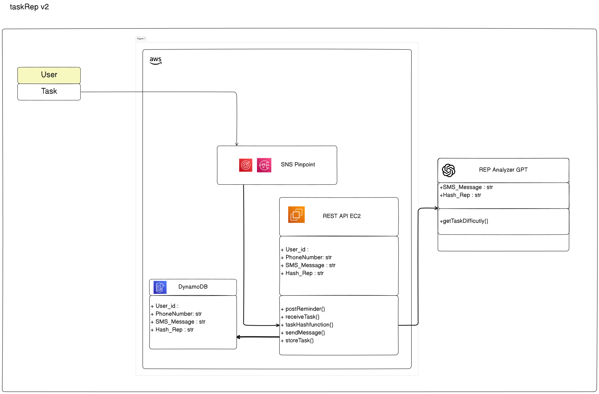

*Ever wonder if there is an online gym? Of course not, how can gym be an online activity?**
*Well this gym is for people who want to mentally rep everyday and keep track of their gains.*
# taskRep
This project aims to productionize the Task Tracker Application on built mainly on AWS(SNS + Lambda + DynamoDB) + gpt4.0 Integrations.
Most Task Tracking App maintain the mundane task of opening the task app, manually putting the task in, and only have a `in-progress` or `finished` check.

The problem that underlies this structure is the **IN-Visibility** of the progression of the task, as well as the task app being another application that has to be opened during the process. 
taskRep tries to solve that problem by being incorporated in to existing mobile apps, such as instagram, mobile phone, instagram, and other social media apps that people open on the daily.

### Structure


User - Phone / Whatsapp / Instagram 
ChatBot - Set the Chatbot to be able to interact with phone numbers
1. Amazon Lex : core service for building conversational interfaces for applications
2. Amazon Pinpoint : 
	- Amazon Pinpoint can manage and send SMS messages to phone numbers.
		- Configure Pinpoint: Set up a project in Amazon Pinpoint and enable SMS channel to manage and send SMS messages.
		- Request a Dedicated Phone Number: Within Pinpoint, you can request a dedicated phone number that will be used to send and receive text messages.
3. AWS Lambda : AWS Lambda can run backend code in response to events (like incoming SMS messages), without provisioning or managing servers.
	- Create a Lambda Function: This function will handle incoming messages from Amazon Pinpoint and pass them to Amazon Lex for processing.
	- Integrate Lex and Lambda: Connect your Lambda function to Amazon Lex to send user messages to Lex, which processes them based on the defined intents and returns the responses.
   
### Event-Driven Integration

To make the chatbot interact through SMS, set up an event-driven architecture to handle incoming and outgoing messages.

- **Pinpoint to Lambda**: Use AWS Lambda to handle incoming SMS messages. When a message comes in, Pinpoint triggers a Lambda function.
- **Lambda to Lex**: The Lambda function sends the content of the SMS to Amazon Lex, which processes the message according to your chatbot’s configuration.
- **Lex to Lambda**: Once Lex processes the message and generates a response, it sends this response back to the same Lambda function.
- **Lambda to Pinpoint**: Finally, the Lambda function sends the response back to the user via SMS through Pinpoint.

Instead for this project, the backend chatbot will be mainly using the GPT for its NLP skills and dynamically allocating the tasks to mental reps.

### Rep Hash Function
All tasks are built different.

Since tasks are dynamic, and there is no structure to one's mental rep(Personal Learning can be "to-each their own" sytle), taskRep creates a hash function that maps each task into a hashmap.
We take simple metrics of the task and then map them into a `taskRep inventory (trp)`, so that retrieving tasks in future can be useful. To combat the uniqueness of the tasks however, hashmaps would avoid the potential clash between two similar tasks. 

### Infrastructure Set Up 
##### Step 1. Setup Pinpoint
This section covers the first steps taken to set up the AWS Backend for taskRep. 
Initial steps are simple as AWS SNS pinpoint takes care of spinning up required SMS phone number and configuration pool.


- Create Pinpoint SMS : AWS Pinpoint configures free phone for SMS to be used. The author creates a pool for the users.
- Create Configuration Set : Configure Cloud Formation for the SMS Pinpoint to be able to connect to Lambda APIs 
- Create Protect Configuration : Configured for certain countries to have the protection for the SMS. 

##### Step 2. Setup Receiving Lambda
Now that the AWS SNS Pinpoint is setup, it is configuring the lambda function to talk to chatGPT. Since this is a Event-Driven architecture, we utilize the `trigger function` in AWS lambda to receive a SNS Trigger.

- Create Event Driven Lambda Function : Below is the initial overview of the Lambda Function

- Develop the **lambda function** to handle the event(incoming message) and then send it to the OpenAI API. 	
  - Storing Global API keys can be a **Security Vulnerablity** and should not be left in the Lambda function or in plain sight. Thus one way to mitigate this would be to 
  
  ```python
	!/usr/bin/env python3

	import json
	import os
	import requests
	from urllib.parse import unquote

	def lambda_handler(event, context):

		print("Recieved Event : " + json.dumps(evennt, indent=2))

		message = json.loads(events['Records'][0]['Sns']['Message'])
		text = unquote(message['text'])

		headers = {
			'Content-Type': 'application/json',
			'Authorization': f'Bearer {os.environ["OPENAI_API_KEY"]}',
		}

		data = {
			"model": "gpt-4o-mini",
			"prompt": text,
			"max_tokens":150,
		}

		response_url = 'https://api.openai.com/v1/engines/davinci/completions'

		response = requests.post(response_url, headers=headers, json=data)
		response_data = response.json()


		if response.status_code != 200:
			print("Error in API response:", response_data)

			return {
				'statusCode': response.status_code,
				'body':json.dumps("Failed to get a valid response from GPT")
			}

		chat_response = respoonse_data['choices'][0]['text'].strip()

		return {
			'statusCode': 200,
			'body': json.dumps(chat_response)
		}

	if __name__ == "__main__":

		with open('test-incoming-sms.json', 'r') as file:
			test_event = json.load(file)
		context = {}

		# Test Lambda
		try :
			response = lambda_handler(test_event, context)
			print("Lambda Function Response: ", response)

		except FileNotFoundError:
			print("Error: The json file was not found.")
		except json.JSONDecodeError:
			print("Error: Failed to decode JSON file")
		except Exception as e:
			print(f"An error occured: {e}")

  ```
  
  The lambda funciton should look something like the code above.
  A gpt generated json file for a SNS message ping that would be the triggering 


``` json
	{
	"Records": [
		{
		"EventSource": "aws:sns",
		"EventVersion": "1.0",
		"EventSubscriptionArn": "arn:aws:sns:REGION:ACCOUNT-ID:TOPIC-NAME:SUBSCRIPTION-ID",
		"Sns": {
			"Type": "Notification",
			"MessageId": "95df01b4-ee98-5cb9-9903-4c221d41eb5e",
			"TopicArn": "arn:aws:sns:REGION:ACCOUNT-ID:TOPIC-NAME",
			"Subject": "Optional subject line",
			"Message": "{\"text\": \"Hello, I need help with my account.\", \"sender\": \"+1234567890\"}",
			"Timestamp": "2022-01-02T12:45:07.000Z",
			"SignatureVersion": "1",
			"Signature": "EXAMPLE",
			"SigningCertUrl": "EXAMPLE",
			"UnsubscribeUrl": "EXAMPLE",
			"MessageAttributes": {
			"AWS.SNS.SMS.SMSType": {
				"Type": "String",
				"Value": "Transactional"
			},
			"AWS.SNS.SMS.SenderID": {
				"Type": "String",
				"Value": "YourSenderID"
			}
			}
		}
		}
	]
	}
```
  
 The first test fails stating the following:
 
 ```
	Test Event Name
	test-smsMessage-json

	Response
	{
	"errorMessage": "Unable to import module 'lambda_function': No module named 'requests'",
	"errorType": "Runtime.ImportModuleError",
	"requestId": "2a477fb0-cf85-4c4a-a5a4-260b016f57ca",
	"stackTrace": []
	}

	Function Logs
	START RequestId: 2a477fb0-cf85-4c4a-a5a4-260b016f57ca Version: $LATEST
	LAMBDA_WARNING: Unhandled exception. The most likely cause is an issue in the function code. However, in rare cases, a Lambda runtime update can cause unexpected function behavior. For functions using managed runtimes, runtime updates can be triggered by a function change, or can be applied automatically. To determine if the runtime has been updated, check the runtime version in the INIT_START log entry. If this error correlates with a change in the runtime version, you may be able to mitigate this error by temporarily rolling back to the previous runtime version. For more information, see https://docs.aws.amazon.com/lambda/latest/dg/runtimes-update.html
	[ERROR] Runtime.ImportModuleError: Unable to import module 'lambda_function': No module named 'requests'
	Traceback (most recent call last):END RequestId: 2a477fb0-cf85-4c4a-a5a4-260b016f57ca
	REPORT RequestId: 2a477fb0-cf85-4c4a-a5a4-260b016f57ca	Duration: 1.30 ms	Billed Duration: 2 ms	Memory Size: 128 MB	Max Memory Used: 31 MB

	Request ID
	2a477fb0-cf85-4c4a-a5a4-260b016f57ca 
 ```

This is most likely due to the request module not being imported correctly into the lambda function.
To run a lambda function with dependencies the following [article](https://docs.aws.amazon.com/lambda/latest/dg/python-package.html#python-package-create-dependencies) gave a pretty good step to step on how to build lambda functions with dependencies.
Although for this lambda there is only `request` module that is needed, it will still be a good exercise.

	
Running the following code runs the zipping and deployment of the dependencies from your local machine.

``` sh
cd function_folder
mkdir package
pip install --target ./package boto3 # Add other dependencies that is required for the lambda function.
```

Now that the dependencies are successfully installed into the package directory, we then zip it up with the function file, which is the required format for uploading on the AWS console.

``` sh
cd package
zip -r ../deployment_package.zip .
zip ../deployment_package.zip lambda_function.py
```

Here the package is ready for upload on the AWS console. Which upon returning to the AWS lambda console, navigate to the Code tab. Then by clicking `uploading from` tab, the upload of the zip package can be completed. 

##### Side Quest : Setting Up OpenAI Key on to your Global Environment
Recently, there has been scraping bots on that internet that detects any and all kind of API keys that get exposed on the internet (especially github). This poses a sever threat when dealing with API, exposing the API key can be a vulnerability that can be simply be avoided. Thus, it is crucial to set your API keys to Environment Variables such as .bashrc / .zshrc

``` sh
vim ~/.bashrc
```

As many developers know, this `bashrc` logs the Global Environments when executing code from the terminal.
This time, since we need to execute python code that calls the `OPENAI_API_KEY`, let us record the key into this file.

``` sh
export OPENAI_API_KEY="your-OPENAI-api-key-here"
```

If the env key is set up properly, then any code that is executed utilizing Global Environments will now be able to retrieve it. 
Now for the final touch,let us set it up by running the `source`command

``` sh
source ~/.bashrc
```

### Transferring from Lambda to EC2

With the code to now recieve for the GPT chat function, a new problem arrised for the structure of the application.
Since we had put the components as sinle lambda function that fire once the`pinpoint`was sent. For a more comprehensive application
the pivot to a EC2 virtual machine to handle more complex requests seemed necesssary.

Thinking about the usecase below is the new architecture with a EC2 as the backbone for the processing of REST APIs

---

# taskRep v2. EC2 Instance
Now for the phase 2 of the project, we extend the project to spin up VM instances on the cloud to host a `RESTful API` so that the different microservices can talk with each other.

Below is the proposed new architecture of the **TaskRep**.



As you can see, implementing the architecture with a instance allows us to reduce many of the redundant `lambda` functions that were laying around in v0 and now can give off a flexible architecture.
With REST API, the functions can take multiple functionality depending on what the situation is, but keeping it in one code base, where as the lambda functions can excel at one specific task at hand, but fail to collaborate with global constructers within the code.


## FastAPI Setup
For this application, we choose `FastAPI` as our main driver for the python based application that we are building with its ease of use and versitility.
j